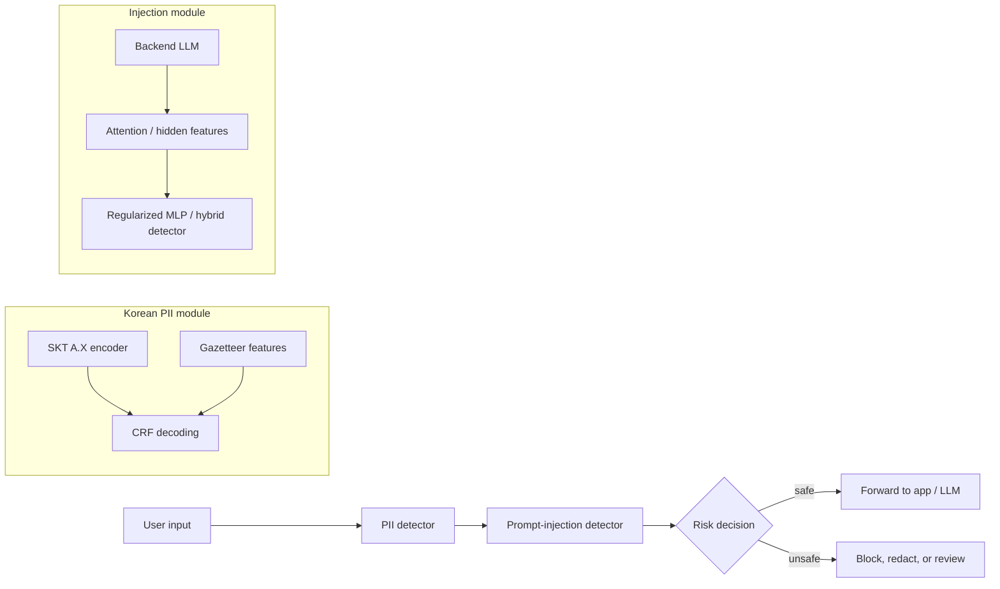

# Campfire AI Security

<p align="center">
  <b>Lightweight local input-security gateway for Korean PII detection and prompt-injection defense</b>
</p>

<p align="center">
  
  
  
  
</p>

Campfire is a research package for a local AI security gateway that filters user inputs before they are passed to an LLM or agent workflow. The project focuses on two practical risks:

- **Korean PII leakage**: detecting names, IDs, phone numbers, addresses, emails, URLs, and other sensitive entities.
- **Prompt injection**: identifying malicious or policy-bypassing instructions using backend-LLM attention features and compact detectors.

This repository is the **public-safe** version. It keeps source code, scripts, aggregate metrics, and release documentation, while excluding raw datasets, detailed PII traces, private logs, pretrained caches, and large intermediate feature dumps.

## Highlights

| Track | Best public-reported result | Main configuration |
|---|---:|---|
| Korean PII detection | **97.5 F1** on Combined test | SKT A.X + CRF + Gazetteer, Mix-all training |
| Prompt-injection detection | **0.992 pooled accuracy** | EXAONE-4.0-1.2B-Camp hybrid detector |
| Prompt-injection risk | **0.006 weighted risk** | `0.7 * FNR + 0.3 * FPR` |

## System Overview



## Repository Map

```text
.
|-- docs/
|   |-- project_overview.md
|   |-- result_mapping.md
|   |-- injection_metrics_snapshot.md
|   |-- public_release_policy.md
|   `-- release_and_backup_policy.md
|-- pii/
|   |-- code/
|   |-- real/
|   |-- release_docs/
|   `-- results/
|-- injection/
|   |-- alignsentinel_replicate/
|   `-- camp_hybrid_exaone/
|-- data/
`-- release_artifacts/
```

## What Is Included

- Experiment code and runner scripts for PII and injection detection.
- Aggregate result artifacts used to reproduce the reported tables.
- Public-safe developer handoff notes for local app integration.
- Model-release documentation and lightweight detector metadata where safe to publish.

## What Is Excluded

- Raw KPII or synthetic PII examples.
- Detailed prediction traces containing PII-like strings.
- Full pretrained model checkpoints and Hugging Face caches.
- Large attention-map, hidden-state, and feature-dump intermediates.
- Local credentials, tokens, server commands, and environment files.

The full internal backup is retained locally outside this public repository. See [`docs/public_release_policy.md`](docs/public_release_policy.md) and [`docs/release_and_backup_policy.md`](docs/release_and_backup_policy.md).

## Quick Start

```bash
git clone https://github.com/peter0524-lab/AI_rookie.git
cd AI_rookie
```

For a high-level explanation, start with:

- [`docs/project_overview.md`](docs/project_overview.md)
- [`docs/result_mapping.md`](docs/result_mapping.md)
- [`docs/injection_metrics_snapshot.md`](docs/injection_metrics_snapshot.md)

For implementation details:

- PII pipeline: [`pii/`](pii/)
- Prompt-injection pipeline: [`injection/`](injection/)
- Release artifact notes: [`release_artifacts/README.md`](release_artifacts/README.md)

## Reproducibility Boundary

This repository is designed for public review and code-level inspection. Some experiments require private datasets or large server-side artifacts that are intentionally not included. The public package therefore supports:

- inspecting model architecture and detector logic,
- checking experiment protocols and aggregate metrics,
- reusing scripts with your own local data,
- understanding the deployment handoff shape.

It does not include enough private data to exactly rerun every internal training job end to end.

## Public-Safe Release Note

Before upload, this repository was scanned for common token and PII patterns. Detailed logs, raw examples, full PII evaluation traces, and files containing PII-like synthetic examples were removed or redacted. Aggregate metrics, source code, reproducibility scripts, and release documentation were retained.
